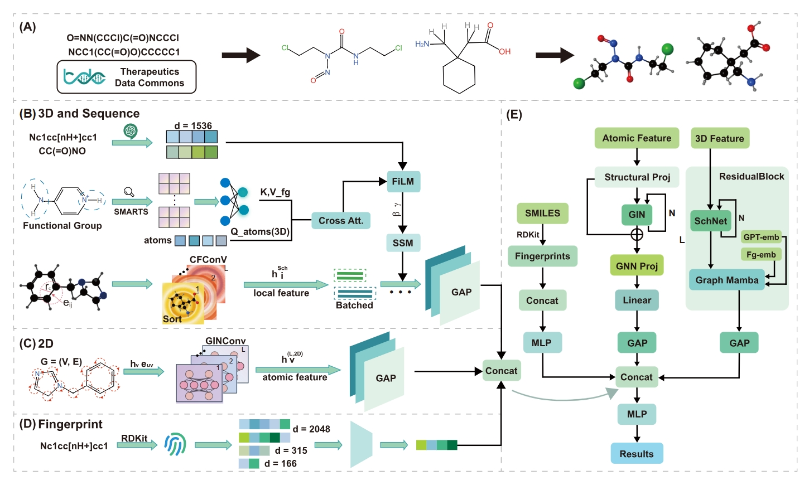

### **Abstract**

Accurate prediction of absorption, distribution, metabolism, and excretion (ADMET) properties is critical for lead optimization and early risk assessment in drug discovery. However, many existing computational approaches rely on a single molecular representation, limiting their ability to simultaneously capture topological features, three-dimensional conformational information, and chemically meaningful functional group characteristics that underlie structure–pharmacokinetic relationships. Here, we present LGSM: an LLM-enhanced graph state mamba framework for multi-modal molecular property prediction .By fusing structural (2D topology), geometric (3D conformational descriptors), and LLM-based semantic representations of functional groups, together with traditional molecular fingerprints, LGSM provides an accurate admet prediction. A large language model–based encoding of SMILES sequences was further incorporated to enhance contextual structural representation. Through hierarchical fusion of structural and semantic information, the model captures both local chemical environments and global spatial relationships within a unified framework. The proposed approach was evaluated on four publicly available benchmark datasets spanning absorption, distribution, metabolism, and excretion tasks under a scaffold split setting to assess generalization to structurally novel compounds. Compared with representative graph neural network models, fingerprint-based methods, and automated machine learning approaches, the framework consistently achieved superior predictive performance. Moreover, interpretability analysis combined with molecular docking studies demonstrated that the model reliably identifies key substructures associated with transporter recognition, metabolic liability, and distribution-related behavior. Overall, this multimodal strategy provides accurate and interpretable predictions, offering a practical computational tool to support rational ADMET evaluation and lead optimization in early-stage drug design.


### **Approach**



### **Env**

**Step 1**:Install PyTorch with the appropriate CUDA version for your system. The command below is provided as an example for CUDA 11.8; please visit the PyTorch official website to obtain the installation command that matches your hardware configuration:
```bash
pip install torch==2.6.0 torchvision==0.21.0 torchaudio==2.6.0 --index-url https://download.pytorch.org/whl/cu118
```

**Step 2**:Step 2: Install PyTorch Geometric and its dependencies:
```bash
pip install pyg_lib torch_scatter torch_sparse torch_cluster torch_spline_conv -f https://data.pyg.org/whl/torch-2.6.0+cu118.html
```
**Step 3**:Install all remaining dependencies:
```bash
pip install -r requirements.txt
```


### **Data Preparation**
All datasets used in this study are sourced from Therapeutics Data Commons (TDC). The raw data files have been organized and uploaded to the data folder of this repository for direct use.You can find the data in 
```
data / CYP2C9_Substrate_CarbonMangels / raw

data / Half_Life_Obach / raw

data / Pgp_Broccatelli / raw

data / VDss_Lombardo / raw
```

### **Data Loading and Preprocessing**
The loader_downstream.py script located in the datasets folder is responsible for loading and preprocessing the raw data. Upon execution, the script will automatically create a processed subfolder within the corresponding dataset directory, where all preprocessed data files will be saved for subsequent model training and evaluation.
Run the following commands from the project root directory to complete the preprocessing step:

```
cd datasets

python loader_downstream.py
```

### **Model Training**
This project provides separate configuration files and training scripts for classification and regression tasks respectively:

**Classification task:** configuration file config.py, training script train_class.py

**Regression task:** configuration file config_reg.py, training script train_spearman.py


All training and evaluation settings are specified in the file config.py or config_reg.py.The configuration files is directly located under the LGSM directory.

This file defines the experimental parameters used for ADMET prediction, including:

&nbsp;&nbsp;&nbsp; **.** Dataset name and data directory

&nbsp;&nbsp;&nbsp;**.**  Train/validation/test split settings
 
&nbsp;&nbsp;&nbsp;**.** Batch size and number of training epochs

&nbsp;&nbsp;&nbsp; **.** Learning rate and weight decay

&nbsp;&nbsp;&nbsp;**.** Random seed for reproducibility

&nbsp;&nbsp;&nbsp;**.** Model hyperparameters

&nbsp;&nbsp;&nbsp;**.** Output directory for saving results

Before training, please modify the relevant hyperparameters (e.g., learning rate, batch size, number of training epochs) in the corresponding configuration file according to your requirements. Once the configuration is complete, run the appropriate training script to start the training process.

When the training script is executed, the configuration is automatically loaded: ```from config import cfg``` or ```from config_reg import cfg```.In the code, parameters are accessed using the format ```cfg.xxx```, which means that the value of ```xxx``` is loaded from the configuration object cfg.
For example, ```dataset = cfg.dataset``` indicates that the dataset name is retrieved from the configuration file.

### **Training**

```
python train_class.py

python train_spearman.py
```
